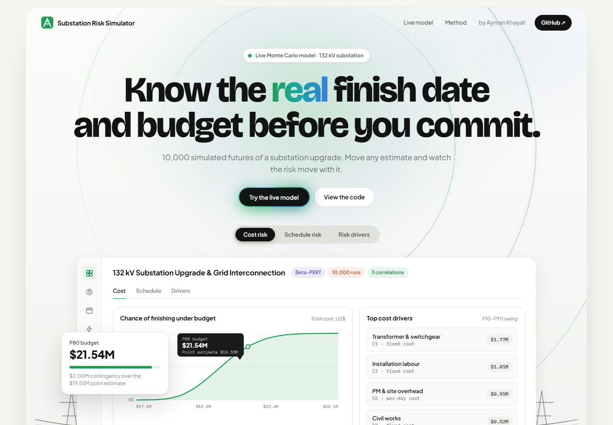

# Substation Risk Simulator

Monte Carlo cost and schedule risk analysis for a capital engineering project, running entirely in the browser.

Designed and built by **Ayman Khayat** · [LinkedIn](https://www.linkedin.com/in/ayman-khayat-350b4b335)

**Live demo:** [aymankhayat.github.io/substation-risk-simulator](https://aymankhayat.github.io/substation-risk-simulator/) · **Case study:** [CASE_STUDY.md](CASE_STUDY.md)



Every activity and cost is entered as a three-point estimate (optimistic / most likely / pessimistic). The simulator runs 10,000+ iterations and answers the two questions a project sponsor asks: *how likely are we to finish by this date, and within this budget?*

The default scenario is a 40 MVA 132/33 kV transformer addition at an existing substation: five activities, five cost lines, and three correlated input pairs. The figures are realistic but illustrative, not taken from a real project.

## Features

- **Live what-if** — sliders and typed entry on every estimate; results recompute as you drag
- **Confidence levels** — cost and completion-date distributions with P50/P80/P90 and contingency over the point estimate
- **Joint probability** — the chance of meeting *both* P80 targets, which is lower than either on its own
- **Critical path** — the activity network is re-solved every iteration, with a criticality index per activity
- **Time-driven costs** — per-day overhead and price escalation turn schedule slip into cost risk
- **Risk drivers** — tornado charts by P10–P90 swing or by rank correlation
- **Correlated inputs** — Iman–Conover method, showing achieved vs target correlation for each pair
- **Editable project** — add, remove and rename activities and cost lines; set predecessors (cycles are blocked); change the start date
- Light and dark themes; nothing leaves the browser

## Methods

| Area | Approach |
|---|---|
| Distributions | Beta-PERT (default) or triangular |
| Schedule | Forward and backward pass over the activity network on every run |
| Cost | Σ fixed costs + project duration × Σ per-day rates |
| Percentiles | Type-7 interpolation (matches Excel `PERCENTILE.INC`) |
| Sensitivity | One-at-a-time P10–P90 swing; Spearman rank correlation |
| Correlation | Iman–Conover rank reordering with van der Waerden scores |
| Reproducibility | Seeded mulberry32 random number generator |

## Tech stack

- React 18 (UMD build) with JSX compiled in the browser by Babel Standalone — no build step, no npm
- Hand-written SVG charts and line illustrations, with no chart library or image files
- Plain JavaScript simulation engine, verified against analytic test vectors
- IBM Plex type family
- Built with AI-assisted development using Claude Code; [`CONTRACTS.md`](CONTRACTS.md) is the module specification the code was written against

## Getting started

No installation. Open `index.html` in a modern browser (an internet connection is needed for the React, Babel and font CDNs).

To serve it locally on Windows instead:

```powershell
powershell -NoProfile -ExecutionPolicy Bypass -File tools/serve.ps1
```

then open http://localhost:8765.

`index.html` is assembled from the modules in `src/`. After editing a module, rebuild it with:

```powershell
powershell -NoProfile -ExecutionPolicy Bypass -File tools/assemble.ps1
```

| File | Role |
|---|---|
| `src/engine.js` | Simulation: sampling, network solve, correlation, statistics |
| `src/scenario.js` | Default scenario, helpers and number formatting |
| `src/charts.jsx` | SVG charts |
| `src/panel.jsx` | Input controls |
| `src/hero.jsx` | Landing hero and live product showcase |
| `src/art.jsx` | Custom SVG illustrations of substation equipment |
| `src/site.jsx` | Landing sections: live ticker, story sections, KPI band, engineering notes, credit |
| `src/site.css` | Landing styles and effects: grain, glowing rings, conic CTA border, reveal |
| `tools/og-card.html` | Source for the 1200×627 share image in `assets/og-card.png` |
| `src/app.jsx` | Page composition and state |
| `src/shell.html` | Styles, theme tokens and page template |

## Before and after

Full-page captures of the portfolio upgrade: [before (desktop)](docs/screenshots/before/desktop.png) · [after (desktop)](docs/screenshots/after/desktop.png) · [after (375 px mobile hero)](docs/screenshots/after/mobile-hero.png). All imagery on the site is real screenshots of the running model; no AI-generated images are used.

## Environment variables

None.
