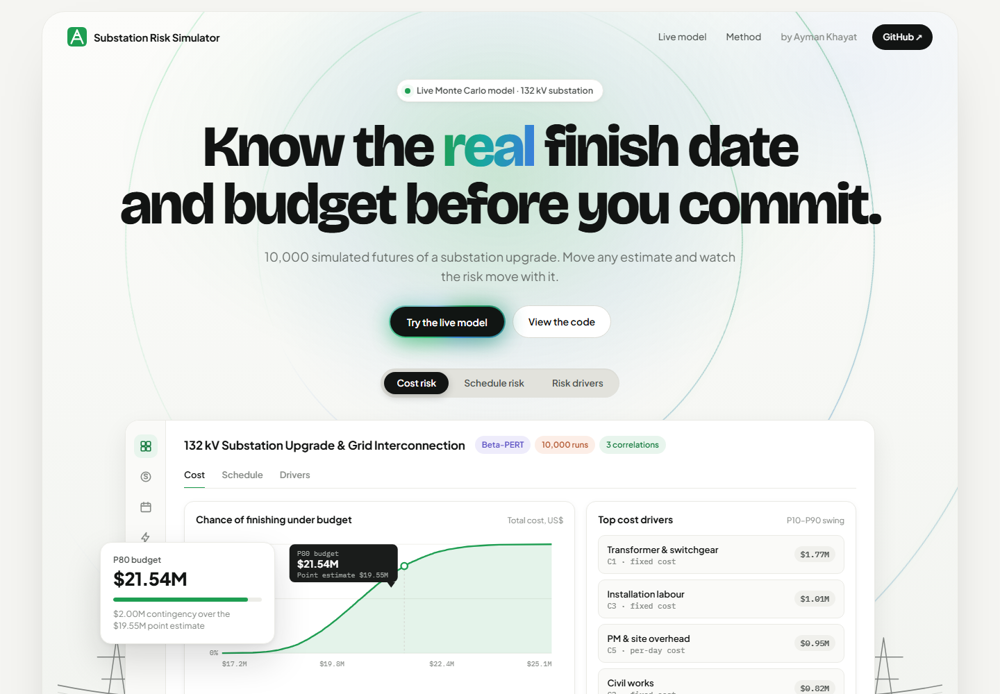

# Substation Risk Simulator

Monte Carlo cost and schedule risk analysis for a capital engineering project, running entirely in the browser.

Designed and built by **Ayman Khayat** · [LinkedIn](https://www.linkedin.com/in/ayman-khayat-350b4b335)

**Live demo:** [aymankhayat.github.io/substation-risk-simulator](https://aymankhayat.github.io/substation-risk-simulator/) · **Case study:** [CASE_STUDY.md](CASE_STUDY.md)

[](https://github.com/aymankhayat/substation-risk-simulator/actions/workflows/ci.yml)



Every activity and cost is entered as a three-point estimate (optimistic / most likely / pessimistic). The simulator runs 10,000+ iterations and answers the two questions a project sponsor asks: *how likely are we to finish by this date, and within this budget?*

The default scenario is a 40 MVA 132/33 kV transformer addition at an existing substation: five activities, five cost lines, and three correlated input pairs. The figures are realistic but illustrative, not taken from a real project.

## Features

- **Live what-if** — sliders and typed entry on every estimate; results recompute as you drag
- **Confidence levels** — cost and completion-date distributions with P50/P80/P90 and contingency over the point estimate
- **Joint probability** — the chance of meeting *both* P80 targets, which is lower than either on its own
- **Critical path** — the activity network is re-solved every iteration, with a criticality index per activity
- **Time-driven costs** — per-day overhead and price escalation turn schedule slip into cost risk
- **Risk drivers** — tornado charts by P10–P90 swing or by rank correlation
- **Correlated inputs** — Iman–Conover method, showing achieved vs target correlation for each pair
- **Editable project** — add, remove and rename activities and cost lines; set predecessors (cycles are blocked); change the start date
- Light and dark themes; nothing leaves the browser

## Methods

| Area | Approach |
|---|---|
| Distributions | Beta-PERT (default) or triangular |
| Schedule | Forward and backward pass over the activity network on every run |
| Cost | Σ fixed costs + project duration × Σ per-day rates |
| Percentiles | Type-7 interpolation (matches Excel `PERCENTILE.INC`) |
| Sensitivity | One-at-a-time P10–P90 swing; Spearman rank correlation |
| Correlation | Iman–Conover rank reordering with van der Waerden scores |
| Reproducibility | Seeded mulberry32 random number generator |

## Tech stack

- React 18 (UMD build) with JSX compiled in the browser by Babel Standalone — no build step, no npm
- Both load from cdnjs, pinned with Subresource Integrity so the browser rejects anything the CDN did not serve when the hashes were taken
- Hand-written SVG charts and line illustrations, with no chart library or image files
- Plain JavaScript simulation engine, verified against analytic test vectors in [`tests/engine.test.mjs`](tests/engine.test.mjs)
- IBM Plex type family
- Built with AI-assisted development using Claude Code; [`CONTRACTS.md`](CONTRACTS.md) is the module specification the code was written against

## Getting started

No installation. Open `index.html` in a modern browser (an internet connection is needed for the React, Babel and font CDNs).

To serve it locally instead, from any platform with Node installed:

```bash
npx --yes serve .
```

On Windows there is also a dependency-free PowerShell server, which listens on http://localhost:8765:

```powershell
powershell -NoProfile -ExecutionPolicy Bypass -File tools/serve.ps1
```

`index.html` is a build artifact: it is assembled from the modules in `src/` and committed so GitHub Pages can serve it without a build step. After editing a module, rebuild it with:

```bash
node tools/assemble.mjs
```

`tools/assemble.ps1` is the equivalent PowerShell script and produces the same file.

## Tests

Two suites run in CI.

The simulation engine is checked against closed-form results rather than against recorded output, so a change to the mathematics fails the suite even when the page still renders.

```bash
node tests/engine.test.mjs
```

The 32 checks in [`tests/engine.test.mjs`](tests/engine.test.mjs) cover:

| Area | Checked against |
|---|---|
| Beta-PERT | Analytic mean (a + 4b + c) / 6 and variance (μ − a)(c − μ) / 7 |
| Triangular | Mean (a + b + c) / 3, closed-form variance, exact CDF value at the mode |
| Percentiles | Excel `PERCENTILE.INC` values on the vector 1..10 |
| Normal quantiles | Published standard normal quantiles (1.959964 at p = 0.975) |
| Critical path | A four-activity network solved by hand: early and late dates, float, critical path |
| Cost model | The identity Σ fixed + duration × Σ per-day, including under a schedule override |
| Rank statistics | Spearman of ±1 on monotonic pairs; averaged ranks on ties |
| Cholesky | Exact factor of [[4, 2], [2, 5]] and reconstruction of the original matrix |
| Iman–Conover | Achieved rank correlation matches the target, and the marginals are unchanged |
| End to end | A project with degenerate estimates must return its exact deterministic answer |

The second suite checks the built page itself, for four properties that stay invisible in a screenshot because the page looks and computes exactly the same when they are wrong.

```bash
node tests/page.test.mjs
```

| Check | Why it matters |
|---|---|
| `<!doctype html>` | Without it the browser falls back to quirks mode |
| `lang` on `<html>` | Screen readers otherwise guess the pronunciation (WCAG 3.1.1) |
| Viewport meta | Without it phones render at the 980 px fallback width, so no breakpoint below it ever applies |
| Subresource Integrity | A compromised CDN could otherwise run arbitrary code with full page privileges |

CI runs both suites on every push and also verifies that the committed `index.html` still matches `src/`.

## Project structure

| File | Role |
|---|---|
| `src/engine.js` | Simulation: sampling, network solve, correlation, statistics |
| `src/scenario.js` | Default scenario, helpers and number formatting |
| `src/charts.jsx` | SVG charts |
| `src/panel.jsx` | Input controls |
| `src/hero.jsx` | Landing hero and live product showcase |
| `src/art.jsx` | Custom SVG illustrations of substation equipment |
| `src/site.jsx` | Landing sections: live ticker, story sections, KPI band, engineering notes, credit |
| `src/site.css` | Landing styles and effects: grain, glowing rings, conic CTA border, reveal |
| `tools/og-card.html` | Source for the 1200×627 share image in `assets/og-card.png` |
| `src/app.jsx` | Page composition and state |
| `src/shell.html` | Styles, theme tokens and page template |
| `tests/engine.test.mjs` | Analytic test vectors for the engine |
| `tests/page.test.mjs` | Doctype, language, viewport and script-integrity checks on the built page |
| `tools/assemble.mjs` | Builds `index.html` from `src/`; `--check` verifies it is current |
| `index.html` | Build artifact, committed so GitHub Pages can serve it directly |

## Before and after

Full-page captures of the portfolio upgrade: [before (desktop)](docs/screenshots/before/desktop.png) · [after (desktop)](docs/screenshots/after/desktop.png) · [after (375 px mobile hero)](docs/screenshots/after/mobile-hero.png). All imagery on the site is real screenshots of the running model; no AI-generated images are used.

## Environment variables

None.

## License

[MIT](LICENSE). The scenario figures are illustrative and are not drawn from a real project.
